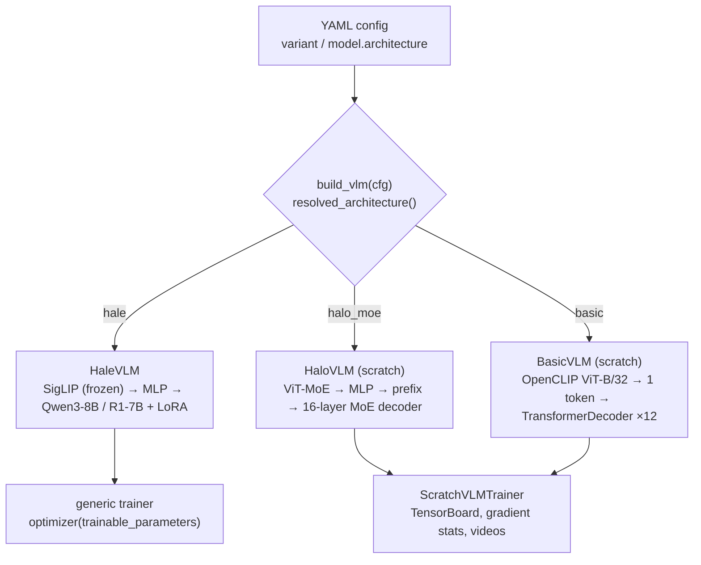
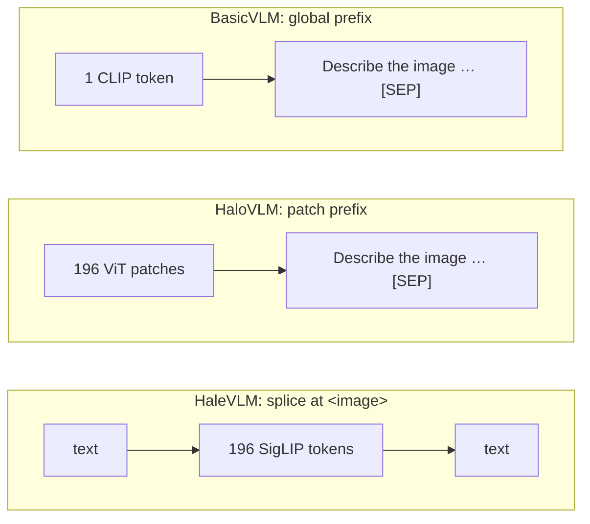
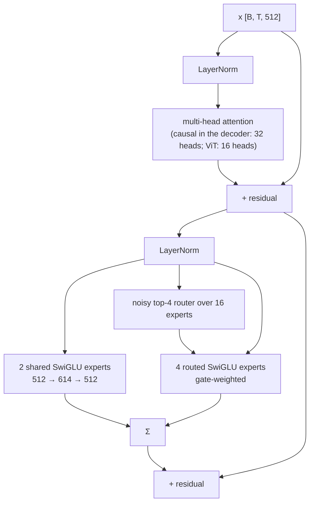
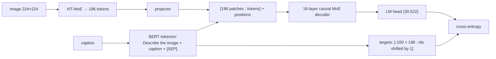

# Architecture overview

A short visual summary. For the full UML component, class and sequence diagrams, see
[architecture.md](architecture.md).

## 1. Three model paths, one factory

## 2. Fusion strategies

## 3. HaloVLM block (encoder and decoder)

## 4. Scratch training sequence and targets

## Sizes

| Model | Parameters |
|---|---|
| HaloVLM (scratch, default) | 431.5M total: ViT 108.8M, decoder 288.7M (≈107.6M active/token), embeddings + head 31.3M, positions 2.6M |
| BasicVLM decoder | 37.9M (+ OpenCLIP ViT-B/32) |
| HaleVLM trainable | Qwen3-8B ≈ 83.5M (LoRA 43.6M + projector 39.9M); R1-Distill-7B ≈ 71.6M |
