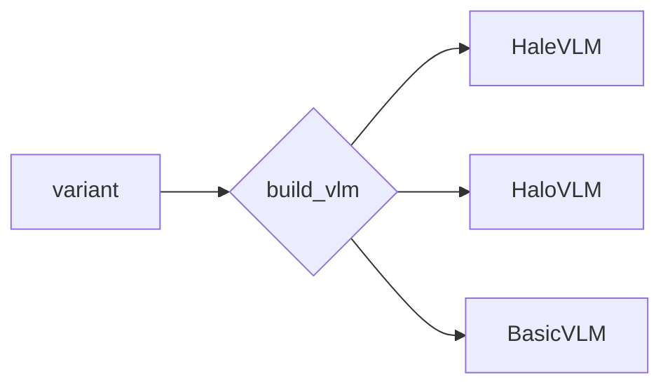

# Three ways to build a vision-language model, in one library

*2026-09-28 · B A NaveenKumar*

> **Summary.** Halo-VLM puts three very different VLM recipes behind one config file and one
> `build_vlm()` call: an 8B LLM with LoRA (about 1% trainable), a 431M-parameter
> mixture-of-experts model trained from scratch, and a one-token CLIP baseline. This post
> explains why you'd want all three in one place and what each teaches.


## Why three?

Each regime answers a different question:

| If you want to… | Use | Because |
|---|---|---|
| get a capable model on one GPU | **HaleVLM** | SigLIP and Qwen3-8B already know vision and language; you train about 84M parameters of glue |
| understand and change every part | **HaloVLM** | every layer is yours: patch size, experts, routing, tokenizer |
| know whether any of it matters | **BasicVLM** | one pooled CLIP vector is the cheapest possible fusion, so it makes a good floor |

In separate repositories, comparing them means three data loaders, three config systems and
three sets of bugs. In Halo-VLM, only the `variant` line changes:

```yaml
variant: halo_vlm_moe        # or qwen3_8b_vlm, or basic_vlm_scratch
```



## The from-scratch one is the interesting one

HaloVLM is small enough to read and big enough to be non-trivial:

- a ViT turns a 224×224 image into 196 patch tokens;
- an MLP projects them and they go **in front of** the caption tokens;
- a 16-layer causal decoder generates the caption.

Every feed-forward layer, in the ViT and in the decoder, is a **DeepSeek-style MoE**: two
shared experts that every token uses, plus 16 routed experts of which each token uses 4.
That's 431.5M parameters in total, but only about 108M of the decoder's 289M are active for
any given token.

92% of the parameters sit in the MoE layers because the BERT vocabulary (30,522 tokens) keeps
the embedding table small. That also makes the model a good testbed for questions like "do
experts specialise between image patches and words?" Collect per-expert routing counts
split by position (patch vs. text) and you have your answer.

## Getting the target shift right

Autoregressive VLM losses are fiddly because the image prefix shifts everything. HaloVLM's
data pipeline shifts the labels **when encoding** (label *t* is token *t+1*) and pads the
196 image positions with `-100`, so the loss is a plain position-wise cross-entropy with
no extra shifting. If you add a model, don't shift twice.

## What the review turned up

Writing the paper meant tracing exactly what each model sees. The scratch path is clean.
The HaleVLM path has two issues shared with the Hale-VLM repository. First, the 196 visual
tokens **overwrite** the 195 tokens after the `<image>` placeholder instead of being
inserted. Second, the loss covers the whole prompt. Both are written up with fixes in
[known-issues.md](../known-issues.md). The test suite passes (29 passed, 2 skipped), which
is a good reminder that shape tests don't catch "the model never sees the question".

## Next

Train all three on COCO captions with the same data and steps, compare 1 vs. 196 visual
tokens and dense vs. MoE, then fix the Hale path and run the SmolVLM vision stage. Code,
paper and diagrams:
[github.com/basaanithanaveenkumar/Halo-VLM](https://github.com/basaanithanaveenkumar/Halo-VLM).
